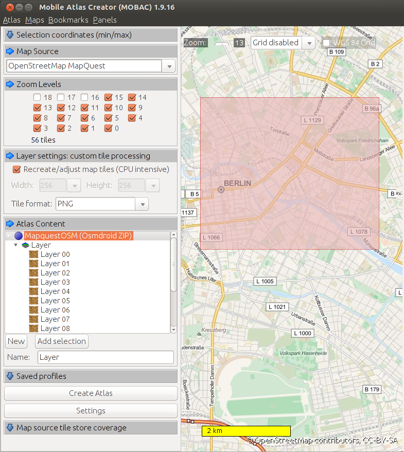

# OSMDroidOfflineDemo

Playing around with offline maps and [osmdroid][osmdroid] ...


## Preparing map tiles

1. Download and install [Mobile Atlas Creator][mobac].
2. Export tiles with the following settings:

    > Mapsource: `OpenStreetMap MapQuest`
    > Tile format: `PNG`
    > Atlas Content: `MapquestOSM`

    

3. Extract the generated archive and make sure the inner folder is named `MapquestOSM`. Zip this folder to a file named `tiles.zip`. The folder structure of the archive should be like this:

  ```
  └── MapquestOSM
      ├── 10
      │   └── 550
      │       └── 335.png
      ├── 11
      │   └── 1100
      │       └── 671.png
      ├── 12
      │   └── 2200
      │       └── 1343.png
      ├── 13
      │   ├── 4400
      │   │   ├── 2686.png
      │   │   └── 2687.png
      │   └── 4401
      │       ├── 2686.png
      │       └── 2687.png
  ```


## Providing map tiles

Put the ZIP archive `tiles.zip` to the sdcard:

> /mnt/sdcard/osmdroid/tiles.zip

The application will automatically find the archive and temporarily unpack the tiles as required.

For the first try there is a tiles archive in the [tiles-example folder](/tiles-example/).

## Referencing map tiles

The application needs to be configured with the correct tile source in order to match the folder name stored in the ZIP archive. This means `MapquestOSM` corresponds with this map view setting:

```java
mapView.setTileSource(TileSourceFactory.MAPQUESTOSM);
```

The expected folder name is specified in [`TileSourceFactory.java`][TileSourceFactory].


# References

* [Using OSMDroid for Offline mapping in Android, step-by-step [Tutorial]][hackseth-using-osmdroid]
* [[App] EnschedeLocator Beta, Offline map and simple navigation in Enschede for Android][enschede-locator]

[osmdroid]: https://github.com/osmdroid/osmdroid
[mobac]: http://mobac.sourceforge.net
[TileSourceFactory]: https://github.com/osmdroid/osmdroid/blob/osmdroid-parent-4.1/osmdroid-android/src/main/java/org/osmdroid/tileprovider/tilesource/TileSourceFactory.java#L104
[hackseth-using-osmdroid]: http://www.haakseth.com/?p=30
[enschede-locator]: http://www.haakseth.com/?p=64
